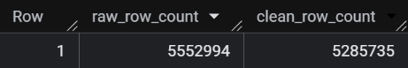
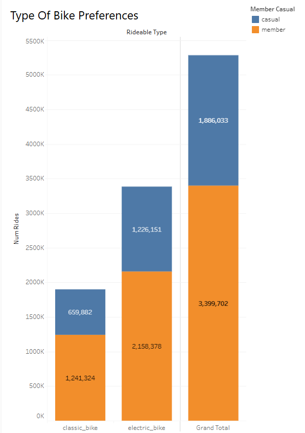
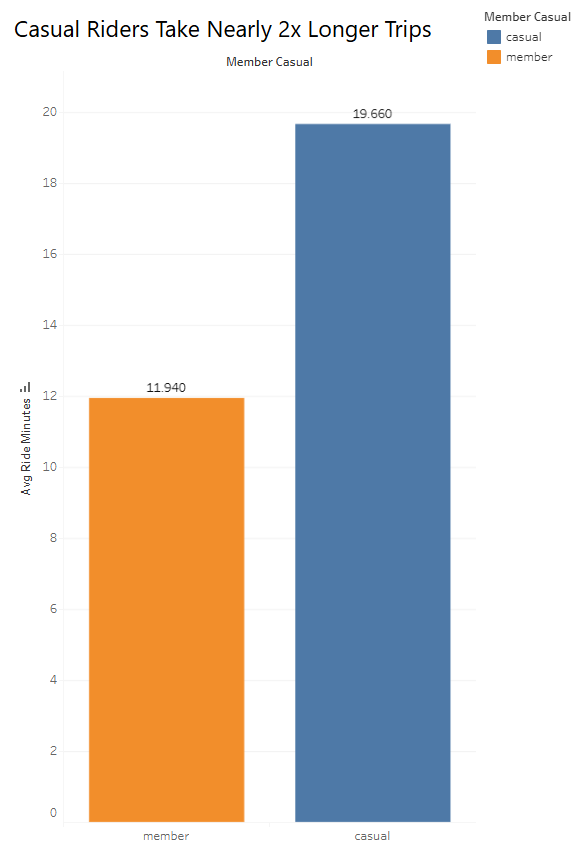
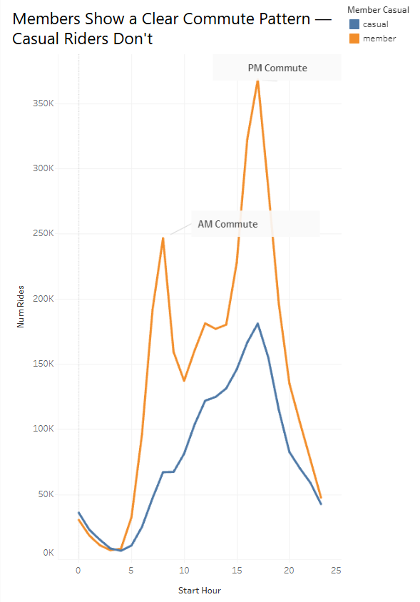
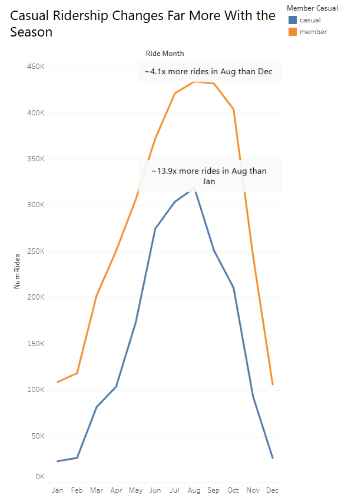
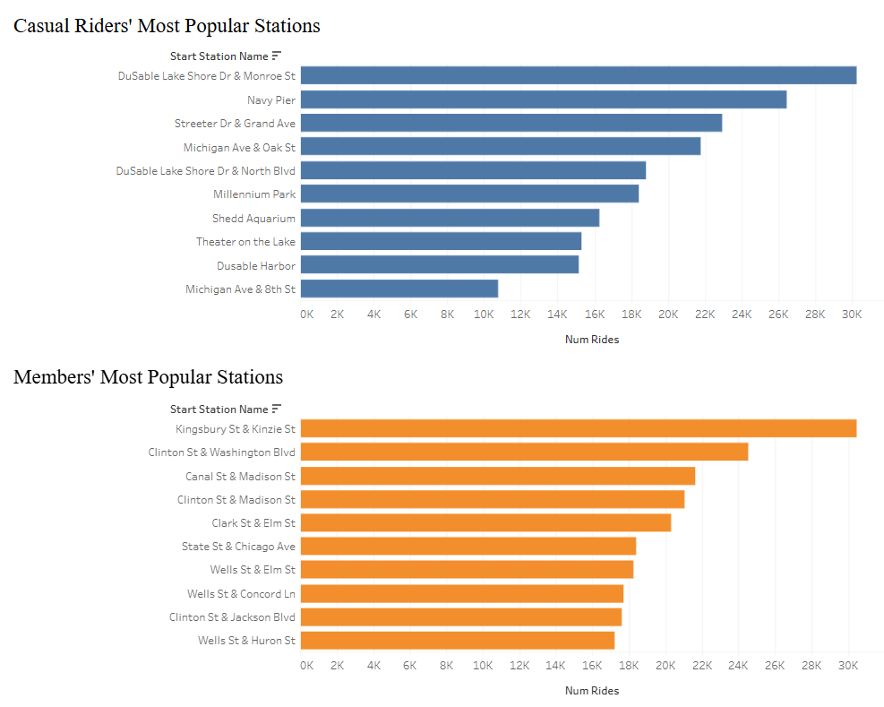
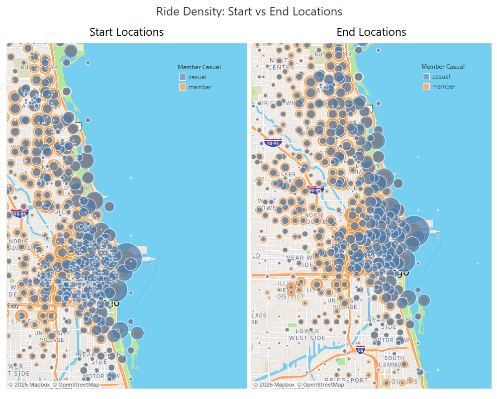

# Google Data Analytics Capstone: Cyclistic Case Study

**Course:** [Google Data Analytics Professional Certificate](https://www.coursera.org/professional-certificates/google-data-analytics)
 
A SQL-based analysis of Chicago's Divvy bike-share trip data. The goal: figure out how casual riders and annual members use the service differently, and turn that into a concrete recommendation for converting casual riders into members.
 
Everything here — data cleaning, exploration, analysis, and the final dashboard — was built in BigQuery SQL and Tableau, working from ~5.5 million real trip records across Jan–Dec 2025.
 
| | |
|---|---|
| **Dataset** | [Divvy trip data](https://divvy-tripdata.s3.amazonaws.com/index.html), Jan–Dec 2025 |
| **Tools** | BigQuery (SQL), Tableau |
| **Dashboard** | [Tableau](https://public.tableau.com/views/CyclisticCaseStudy-GoogleDataAnalyticsCapstoneProject/BikePreferences?:language=en-GB&:display_count=n&:origin=viz_share_link) |
| **Scripts** | [`01_data_exploration.sql`](./01_data_exploration.sql) · [`02_data_cleaning.sql`](./02_data_cleaning.sql) · [`03_data_analysis.sql`](./03_data_analysis.sql) |
 
The write-up below follows the standard data analysis process — asking the right question, preparing and cleaning the data, analyzing it, and turning findings into a recommendation.

## Introduction

In this case study, I take on the role of a junior data analyst at a fictional bike-share company, Cyclistic.

To answer the key business question, I follow the steps of the data analysis process:
[Ask](#ask) · [Prepare](#prepare) · [Process](#process) · [Analyze](#analyze) · [Share](#share) · [Act](#act)

### Background

**Cyclistic** is a fictional bike-share company operating in Chicago, with a fleet of bicycles distributed across a network of docking stations citywide. Alongside standard two-wheeled bikes, Cyclistic offers electric bikes that riders can lock independently of a docking station, which turned out to be relevant to some of the data patterns explored later in this project.

Riders fall into two groups: **casual riders**, who purchase single-ride or full-day passes, and **members**, who hold annual memberships. Cyclistic's finance team has found that members are significantly more profitable than casual riders, and the director of marketing, Lily Moreno, believes the clearest path to growth isn't acquiring new customers — it's converting the casual riders Cyclistic already has into members.

To do that effectively, the marketing team first needs to understand something more basic: **how do casual riders and members actually use Cyclistic differently?**

### Scenario

For this project, I take on the role of a junior data analyst on Cyclistic's marketing analytics team. Moreno has assigned my team the first of three guiding questions in this larger initiative: *how do annual members and casual riders use Cyclistic bikes differently?* The answer needs to be backed by real data and clear visualizations, since Cyclistic's executive team will ultimately decide whether to greenlight any resulting marketing strategy based on this analysis.

This repository documents that full process — from raw trip data through cleaning, analysis, and final recommendations.

## Ask

Cyclistic's finance team has determined that annual members generate significantly more revenue than casual riders. Based on that, the director of marketing wants a strategy to convert existing casual riders into members — rather than spending on acquiring entirely new customers.

That effort is guided by three questions, of which this analysis covers the first:

1. **How do annual members and casual riders use Cyclistic bikes differently?** *(this analysis)*
2. Why would casual riders buy a Cyclistic membership?
3. How could digital media influence that conversion?

> **Business task:** identify the behavioral differences between casual riders and members, so the marketing team has concrete evidence to design a conversion strategy around — rather than guessing at what might motivate a casual rider to upgrade.

## Prepare

This analysis uses [Divvy's public trip data](https://divvy-tripdata.s3.amazonaws.com/index.html), covering **January through December 2025** (12 months, ~5.5 million individual trips). Divvy is the real bike-share system that Chicago's Cyclistic is modeled on, and its historical data is made available by Motivate International Inc. under this [license](https://www.divvybikes.com/data-license-agreement).

**Format:** one CSV per month, each following the same schema — `ride_id`, `rideable_type`, `started_at`, `ended_at`, `start_station_name`, `start_station_id`, `end_station_name`, `end_station_id`, `start_lat`, `start_lng`, `end_lat`, `end_lng`, `member_casual`.

**Credibility:** this is first-party operational data collected directly by the bike-share system itself (not a survey or third-party aggregation), so it's a reliable and unbiased record of what actually happened on each trip. Its one meaningful limitation, by design: no personally identifiable rider information is included, which means it's not possible to tell whether a given casual rider has taken multiple single-ride trips, or whether they live within Cyclistic's service area.

## Process

### Data Combining 

Each monthly CSV was loaded into a single table (`trips_raw`) in Google BigQuery, appending one month at a time rather than keeping 12 separate tables — this made every later query (filtering, aggregating, joining across months) run against one consistent source instead of requiring a `UNION` every time.

### Data Exploration
 
Before cleaning anything, every column in the combined trip data was checked for issues — duplicates, missing values, out-of-range values, and inconsistent labels. The full queries for this step are in [`01_data_exploration.sql`](./01_data_exploration.sql). 

A summary of what was found:
 
- **ride_id:** no duplicates found, and every ride_id is the same character length. No cleaning needed.
- **rideable_type:** only two values present — `classic_bike` and `electric_bike`. No naming inconsistencies.
- **member_casual:** only two values present — `member` and `casual`. No inconsistencies.
- **started_at / ended_at (ride length):** out of ~5.55 million total rides, 261,512 lasted a minute or less and 5,585 lasted over a day. A further 29 rows had a negative duration (end time before start time) — a clear data error. The short-ride group skews electric (220,424 of 261,512), though classic bikes account for a meaningful share as well (41,088); the over-a-day group is mostly casual riders on classic bikes (4,677 of 5,585). Both groups are removed from the cleaned dataset as outliers, though the casual-rider pattern is carried forward as a finding rather than discarded entirely.
- **start_station_name / end_station_name:** classic bikes were almost never missing a station name (0.3% of rows) — these are treated as data errors and removed. Electric bikes were missing a station name much more often (about a third of rows), but a follow-up check confirmed these rows still had valid coordinates, meaning the bike was genuinely locked at a real location that just isn't a named docking station. These rows are kept, with the missing name relabeled instead of removed. No maintenance or test station names (e.g. containing "warehouse," "repair," "test") were found in either field.
- **start_lat / start_lng / end_lat / end_lng:** checked for missing values; none remained unaccounted for once the station-name findings above were addressed.

## Analyze

With `trips_clean` built (~5.29 million rides, down from ~5.55 million raw — about 4.8% removed as outliers or errors), the analysis queries in [`03_data_analysis.sql`](./03_data_analysis.sql) answer the core question directly: **how do casual riders and members actually use Cyclistic differently?** A few clear patterns emerge.

### Ride duration

Across all riders, the average trip lasts **14.69 minutes**, ranging from a filtered minimum of 2 minutes up to 1,439 minutes — just shy of the 24-hour cutoff used during cleaning.

Split by rider type, though, the averages diverge sharply:

| Rider type | Avg. ride length |
|---|---|
| Casual | 19.66 min |
| Member | 11.94 min |

Casual riders' trips run roughly **65% longer** than members' — around 7.7 minutes more per ride, on average. This alone suggests the two groups are using the bikes for fundamentally different purposes: quick, repeated point-to-point trips for members, versus longer, more leisurely trips for casual riders.

### Bike type preference

| Rider type | Classic bike | Electric bike |
|---|---|---|
| Casual | 35.0% | 65.0% |
| Member | 36.5% | 63.5% |

Both groups lean toward electric bikes by a similar margin — this isn't a strong point of divergence. Casual riders are only marginally more likely to choose an electric bike (65.0% vs. 63.5%), so bike type on its own doesn't explain much of the behavioral difference between groups.

### Time-of-day patterns

This is where the split becomes obvious. Member ride volume shows a clear **bimodal commute pattern** — a sharp peak around 8 AM (~245K rides) and a taller one around 5 PM (~370K rides), with a dip in between. Casual ride volume shows a single, broader peak in the mid-to-late afternoon (~5–6 PM, ~180K rides) and no real morning spike at all.

In other words: members are riding to and from somewhere on a schedule — most likely work. Casual riders are riding when it's convenient or pleasant to do so, with no obligation driving an early start.

### Seasonality

Both groups ride far more in summer than winter, but the swing is much more extreme for casual riders:

- **Members:** ~4.1x more rides in August than December
- **Casual riders:** ~13.9x more rides in August than January

Member demand is seasonal but comparatively stable — consistent with a routine that continues (at a reduced rate) even in bad weather. Casual demand nearly disappears in winter and surges in summer, which fits a rider base weighted toward tourism, recreation, and fair-weather use rather than daily necessity.

### Where rides start and end

The top 10 stations by rider type are geographically distinct:

- **Casual riders** cluster around lakefront and tourist destinations — DuSable Lake Shore Dr & Monroe St, Navy Pier, Millennium Park, Shedd Aquarium, and similar spots along the waterfront.
- **Members** cluster around Loop/River North business-district intersections — Kingsbury St & Kinzie St, Clinton St & Washington Blvd, Canal St & Madison St, and nearby streets.

This reinforces the same story as the timing data: casual riders are drawn to places people visit, members are drawn to places people work.

One nuance worth flagging: when start and end locations are aggregated onto a coordinate grid and mapped, the two maps look nearly identical at the city/neighborhood level, for both rider types. This is not a data error — it's a real result of most trips being short enough that a rider's start and end neighborhood are usually the same. **It should not be read as evidence that stations "self-balance."** Similar totals at this level of aggregation can still hide meaningful net imbalances at the individual-station level — a station a few blocks away could be steadily gaining or losing bikes even while the neighborhood-wide picture looks flat. Station-level rebalancing remains necessary regardless of what the aggregate map suggests.

## Share

The visualizations below were built in Tableau from the query outputs above. The full interactive dashboard is available on Tableau Public: **[Cyclistic Case Study Dashboard](https://public.tableau.com/views/CyclisticCaseStudy-GoogleDataAnalyticsCapstoneProject/BikePreferences?:language=en-GB&:display_count=n&:origin=viz_share_link)**. The underlying queries for every chart are in [`03_data_analysis.sql`](./03_data_analysis.sql).

**Bike type preference by rider type**
Both groups favor electric bikes by a similar margin — the difference between casual and member usage here is modest.

**Average ride length: members vs. casual riders**
Casual riders' trips run substantially longer on average than members'.

**Rides by hour of day**
Members show a clear two-peak commute pattern; casual riders show one broad afternoon peak and no morning spike.

**Rides by month (seasonality)**
Casual ridership swings far more dramatically across the seasons than member ridership does.

**Top 10 most popular start stations, by rider type**
Casual riders' top stations are recreational/lakefront destinations; members' top stations are business-district intersections.

**Ride density: start vs. end locations**
At this level of aggregation, start and end locations look nearly identical for both rider types — see the note on station rebalancing above for why this shouldn't be over-interpreted.

## Act

Three recommendations fall out of this fairly directly:
 
1. **Meet casual riders where they already are.** They cluster at lakefront and tourist stations, and ride nearly 14x more in August than January. Signage, in-app prompts, and QR codes at those specific stations, running late spring through summer, will land a lot better than a citywide, year-round campaign.

2. **Pitch membership on the math casual riders are already living.** They're riding ~65% longer per trip than members — so "you're already riding enough that a membership would pay for itself" isn't a generic upsell, it's just true. Could even be automated: trigger the message the moment a ride crosses that break-even point.

3. **Promote on afternoons and weekends, not commute hours.** Casual riders barely show up in the morning and peak mid-afternoon, so the commute-hour push that works for members will mostly miss them. A separate weekend/afternoon campaign has a much better shot at reaching them.
